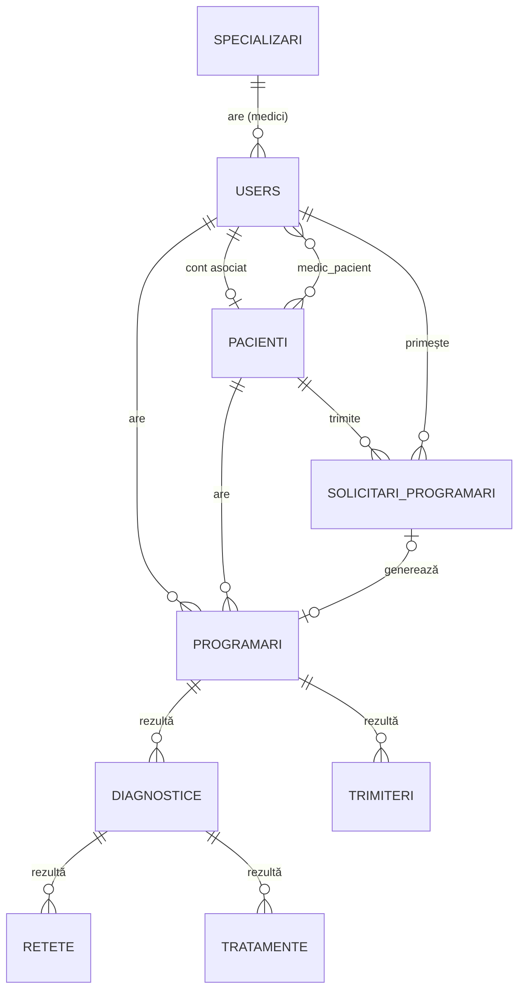

# E-Spital — Aplicație web pentru gestiunea istoricului medical


În acest proiect am implementat o aplicație web ce utilizează framework-ul **Laravel** adaptată necesităților spitalului pentru gestiunea istoricului medical. Sistemul folosește un model de date relațional (MySQL) unde avem entități principale precum **Medic**, **Admin** și **Pacient**, legate prin relații _one-to-many_. Un admin gestionează medicii, iar un medic gestionează pacienții.

Aplicația folosește o arhitectură client–server, 3 tipuri de utilizatori, control strict al accesului și notificări automate prin email.

---

## Cuprins

- [Funcționalități](#-funcționalități)
- [Tehnologii](#-tehnologii)
- [Arhitectură](#-arhitectură)
- [Model de date](#-model-de-date)
- [Instalare și rulare](#-instalare-și-rulare)
- [Conturi de test](#-conturi-de-test)
- [Notificări și scheduler](#-notificări-și-scheduler)
- [Securitate](#-securitate)
- [Structura proiectului](#-structura-proiectului)
- [Rute principale](#-rute-principale)
- [Limitări și direcții viitoare](#-limitări-și-direcții-viitoare)
- [Documentație completă](#-documentație-completă)

---

## Funcționalități

### Toți utilizatorii
- Înregistrare cu rol (admin / medic / pacient) și validare dublă (JavaScript + Laravel)
- Autentificare cu email și parolă, redirecționare automată către dashboard-ul rolului
- Deconectare cu invalidarea sesiunii și regenerarea token-ului CSRF
- Vizualizare, editare și ștergere cont propriu

### Administrator
- Dashboard cu statistici agregate (pacienți, programări, rețete, diagnostice, tratamente, trimiteri) pe: azi, săptămână, lună, an, total
- CRUD complet pentru **medici** și **specializări**
- Profil complet al fiecărui medic (date personale, programări, rețete, diagnostice, tratamente, trimiteri)
- Căutare, filtrare, sortare și paginare (10 rânduri/pagină, configurabil) pentru toate entitățile
- **Nu** are acces la datele medicale ale pacienților

### Medic
- Gestionare pacienți (adăugare pacient nou sau asociere pacient existent, editare, ștergere)
- Istoric medical complet pentru fiecare pacient
- CRUD pentru **programări**, **diagnostice**, **rețete**, **tratamente** și **trimiteri**
- Calendar al programărilor (viitoare / finalizate / amânate) și butoane rapide de status
- Dashboard cu: solicitări de programare în așteptare, următoarea programare, ultimele 5 programări, programări întârziate, statistici săptămânale, rețete și tratamente care expiră în maxim 7 zile
- Acceptare sau respingere a solicitărilor de programare ale pacienților

### Pacient
- Vizualizarea propriului dosar medical (istoric complet)
- Solicitare de programare la un medic, cu interval preferat și mesaj opțional
- Notificări în aplicație despre statusul solicitărilor (acceptată / respinsă) și posibilitatea de a le șterge
- Remindere prin email cu o zi înainte de programare

### Sistem de email (Scheduler)
- Email automat la acceptarea / respingerea unei solicitări
- Remindere zilnice la **08:00** pentru programări, rețete, tratamente și trimiteri care expiră

### Reguli de business — programări
| Regulă | Detalii |
|---|---|
| Statusuri acceptate | `viitoare` · `finalizata` · `amanata` |
| Finalizare | Permisă doar dacă data este în trecut |
| Status „viitoare" | Necesită o dată în viitor |
| Solicitări | Statusuri `trimisă` · `rezolvată` · `respinsă`; data de start trebuie să fie în viitor, iar data de final după data de start |

---

## Tehnologii

| Zonă | Tehnologie |
|---|---|
| Backend | PHP 8.2+, Laravel 12 (MVC), Eloquent ORM |
| Bază de date | SQLite (implicit în `.env.example`) sau MySQL |
| Frontend | Blade, HTML, CSS, JavaScript |
| Build assets | Vite 7, Tailwind CSS 4 |
| Autentificare | Laravel Auth + middleware propriu pentru roluri |
| Email | Laravel Mail (Markdown mailables), Mailtrap / SMTP |
| Testare | Pest |
| Date de test | Seeders + Faker (locale `ro_RO`) |

---

## Arhitectură

Aplicația respectă modelul **MVC** din Laravel:

- **Models** — entități Eloquent și relațiile dintre ele (`app/Models`)
- **Views** — șabloane Blade, cu un layout comun al cărui meniu se adaptează după rolul utilizatorului (`resources/views`)
- **Controllers** — câte un controller per entitate, plus controllere pentru autentificare, cont și solicitări (`app/Http/Controllers`)
- **Middleware** — `auth` (autentificare) și `rol:<admin|medic|pacient>` (`VerifRol`)
- **Console Commands + Scheduler** — comenzi Artisan pentru remindere, programate zilnic

---

## Model de date




După cum se poate vedea în diagrama de mai sus, în baza noastră de date avem admini, medici și pacienți, care fiecare la randul lor au programari, diagnostice, rețete, tratamente si trimiteri. Pe langă acestea, fiecare medic are o specializare, iar legătura dintre medici si pacienți este făcută cu ajutorul unei tabele pivot (Un medic poate avea mai mulți pacienți, dar și un pacient poate să viziteze mai mulți medici).  În urma unei programări rezultă un diagnostic, în urma unui diagnostic rezultă o rețetă și, dacă e cazul, un tratament recomandat de medic. De asemenea, un medic poate să îi ofere unui pacient o trimitere din diverse motive.

În acest fel, un medic poate avea mai mulți pacienți, un pacient poate avea mai mulți medici, un medic poate avea o singură specializare însa o specializare poate aparține mai multor medici. Un medic/pacient poate avea mai multe programări, diagnostice, rețete, tratamente și trimiteri însă nu și invers. O programare poate avea mai multe diagnostice sau trimiteri, un diagnostic poate aparține mai multor rețete sau tratamente, o rețetă/tratament nu poate avea mai multe diagnostice. Pacientii pot solicita mai multe programări, iar medicii pot primi, de asemenea, mai multe solicitări.

Pe scurt:
- un medic are **o singură specializare**, iar o specializare poate aparține mai multor medici;
- un medic poate avea mai mulți pacienți și un pacient poate fi văzut de mai mulți medici (tabel pivot `medic_pacient`);
- din **programare** rezultă **diagnostic**, iar din diagnostic rezultă **rețetă** și, după caz, **tratament**; medicul poate emite și **trimiteri**;
- pacienții trimit **solicitări de programare**, care pot fi acceptate (se creează programarea) sau respinse.

Tabelele sunt create prin migrații (`database/migrations`), fără intervenție manuală.

---

## Instalare și rulare

### Cerințe
- PHP **8.2+** 
- [Composer](https://getcomposer.org/)
- Node.js și npm
- MySQL, dacă nu folosești SQLite

### Pași

```bash
# 1. Clonează repository-ul
git clone https://github.com/TheMysteryX/Aplicatie-WEB-pentru-gestiunea-istoricului-medical.git
cd Aplicatie-WEB-pentru-gestiunea-istoricului-medical

# 2. Instalează dependențele
composer install
npm install

# 3. Configurează mediul
cp .env.example .env
php artisan key:generate

# 4. Pregătește baza de date (SQLite, implicit)
touch database/database.sqlite

# 5. Rulează migrațiile și populează baza cu date de test
php artisan migrate --seed

# 6. Compilează asset-urile
npm run build        # sau `npm run dev` pentru dezvoltare

# 7. Pornește serverul
php artisan serve
```

Aplicația va fi disponibilă la **http://localhost:8000** (ruta `/` redirecționează către `/login`).

### Folosirea MySQL (opțional)

În `.env`, înlocuiește configurația SQLite cu:

```env
DB_CONNECTION=mysql
DB_HOST=127.0.0.1
DB_PORT=3306
DB_DATABASE=spital
DB_USERNAME=root
DB_PASSWORD=
```

apoi creează baza de date `spital` și rulează `php artisan migrate --seed`.

### Resetarea bazei de date

```bash
php artisan migrate:fresh --seed   # șterge tot și reia migrațiile + seeders
php artisan migrate:rollback       # anulează ultimul lot de migrații
php artisan migrate:refresh        # rollback complet + remigrare
```

### Configurare email

În `.env.example`, `MAIL_MAILER=log`, deci emailurile sunt scrise în `storage/logs/laravel.log`. Pentru a le vedea într-un inbox de test (ex. [Mailtrap](https://mailtrap.io/)):

```env
MAIL_MAILER=smtp
MAIL_HOST=sandbox.smtp.mailtrap.io
MAIL_PORT=2525
MAIL_USERNAME=<username-ul-tău>
MAIL_PASSWORD=<parola-ta>
MAIL_FROM_ADDRESS="noreply@spital.com"
MAIL_FROM_NAME="Spitalul Life"
```

> [!WARNING]
> Nu comite niciodată fișierul `.env` (este deja în `.gitignore`).

---

## Conturi de test

Seeders-ele (`database/seeders`) creează automat date de test:

| Rol | Cont | Observații |
|---|---|---|
| Administrator | definit în `AdminiSeeder.php` | cont explicit |
| Medic | `pop@yahoo.com` / `popescu` | medicul Ion Popescu, creat explicit |
| Medici (generați) | emailuri generate de Faker | parola `password` |
| Pacienți | 10 pacienți generați | fără cont de login; un pacient își poate crea cont prin **Înregistrare** |

Seeders creează: specializări, un admin, medici, pacienți, programări, diagnostice, rețete, tratamente și trimiteri.

> [!WARNING]
> Conturile și parolele de mai sus sunt **doar pentru dezvoltare/demo**. Nu le folosi într-un mediu real.

---

## Notificări și scheduler

Comenzile Artisan de mai jos sunt programate zilnic la **08:00** (`routes/console.php`):

| Comandă | Acțiune |
|---|---|
| `app:trimite-reminder-programari` | Reminder pentru programările de a doua zi |
| `app:trimite-reminder-retete` | Reminder pentru rețete care expiră |
| `app:trimite-reminder-tratamente` | Reminder pentru tratamente care expiră |
| `app:trimite-reminder-trimiteri` | Reminder pentru trimiteri care expiră |

Pornirea scheduler-ului în dezvoltare:

```bash
php artisan schedule:work
```

În producție, folosește o intrare cron:

```cron
* * * * * cd /cale/catre/proiect && php artisan schedule:run >> /dev/null 2>&1
```

Poți rula manual orice comandă, de exemplu:

```bash
php artisan app:trimite-reminder-programari
```

Emailurile de confirmare / respingere a solicitărilor sunt trimise imediat, la acțiunea medicului (`ProgramareAcceptataMail`, `ProgramareRespinsaMail`).

---

## Securitate

- Parole stocate criptat (**bcrypt**) și excluse din serializare
- Protecție **CSRF** (token-uri Laravel), regenerarea sesiunii la login și invalidarea ei la logout
- Protecție împotriva **SQL Injection** și **XSS** prin Eloquent ORM și escaping-ul din Blade
- Protecție **mass assignment** prin `$fillable` definit explicit
- Control al accesului pe rute: `auth` + `rol:admin|medic|pacient`, cu separare strictă între roluri (răspuns `403` la acces interzis)
- Validare **dublă**: client-side (JavaScript, feedback instant) și server-side (Laravel, garanția reală)

---

## Structura proiectului

```
├── app/
│   ├── Console/Commands/     # comenzi pentru remindere email
│   ├── Http/
│   │   ├── Controllers/      # Auth, Admin, Medic, Pacient, Programare, Reteta, ...
│   │   └── Middleware/       # VerifRol (rol:admin|medic|pacient)
│   ├── Mail/                 # Mailables (acceptare, respingere, remindere)
│   └── Models/               # User, Pacient, Specializare, Programare, Diagnostic, ...
├── database/
│   ├── migrations/           # schema bazei de date
│   └── seeders/              # date de test (Faker ro_RO)
├── resources/views/          # Blade: layouts, admin, medic, pacienti, programari, mail, ...
├── routes/
│   ├── web.php               # rute web + middleware
│   └── console.php           # programarea comenzilor (scheduler)
├── public/                   # index.php, css, img
├── tests/                    # teste Pest
└── composer.json / package.json
```

---

## Rute principale

| Zonă | Rute | Acces |
|---|---|---|
| Autentificare | `/login`, `/register`, `/logout` | public / autentificat |
| Admin | `/admin/dashboard`, `resource medici`, `resource specializari` | `rol:admin` |
| Medic | `/medic/dashboard`, `resource pacienti`, `programari`, `retete`, `diagnostice`, `tratamente`, `trimiteri`, `/medic/solicitari` | `rol:medic` |
| Pacient | `/pacient/dashboard`, `/pacient/istoric`, `/solicitare/create` | `rol:pacient` |
| Cont | `/cont`, `/cont/edit`, `/cont/update`, `/cont/delete` | autentificat |

Lista completă: `php artisan route:list`.

---

## Limitări și direcții viitoare

**Limitări cunoscute**
- Optimizată pentru spitale mici și medii; volume mari necesită indexare, caching și scalare
- Aplicație web, **fără mod offline**
- Nu implementează complet cerințele GDPR (criptare la repaus, audit logging, anonimizare)
- Lipsesc funcții medicale avansate (imagistică, analiza riscurilor, schimb de date între spitale)

**Îmbunătățiri posibile**
- Interfață reactivă (Vue.js / React / Livewire)
- Roluri suplimentare (recepționer, asistent medical, medic șef de secție, super-admin)
- API REST pentru o aplicație mobilă și integrări externe (laboratoare, farmacii), eventual standarde precum HL7 FHIR
- Indexare în baza de date și notificări SMS
- Module noi: plăți, rapoarte statistice, arhivare documente

---

## Documentație completă

Documentația detaliată a proiectului (actori, cerințe funcționale și non-funcționale, cazuri și scenarii de utilizare, diagrame UML și ER) se află in fișierul `Documentatie_E-Spital.pdf`.
